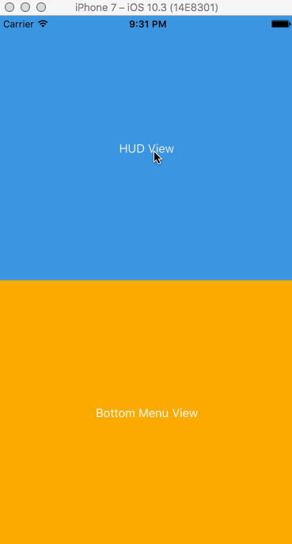

# TransparentViewControllerSample

This is a sample of transparent view controller.
The presenting ViewController has transparent background.



You can do this like the code bellow (before presenting the ViewController).

```
segue.destination.modalTransitionStyle = .crossDissolve
segue.destination.modalPresentationStyle = .overCurrentContext
```
